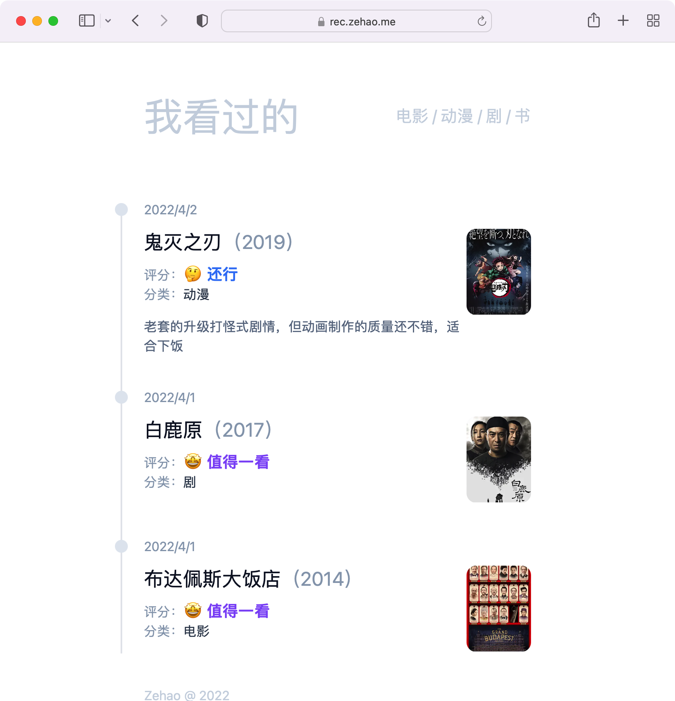
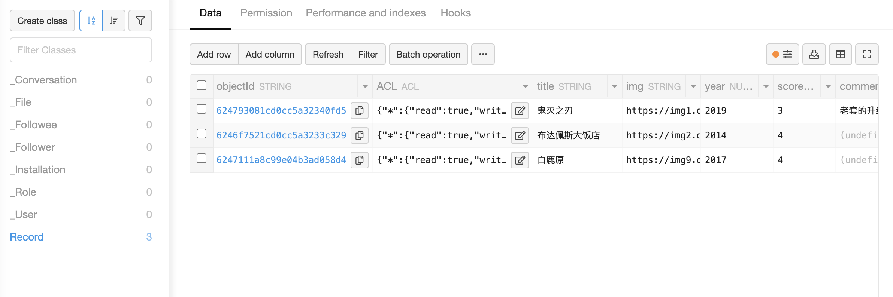

## 前言
通过本教程您将了解到：
* 使用 LeanCloud^[LeanCloud：后端即服务平台 [https://www.leancloud.app/](https://www.leancloud.app/)] 作为免费数据库
* 使用 Next.js^[Next.js：一个 React 框架 [https://nextjs.org/](https://nextjs.org/)] 开发一个包含前后端的应用
* 将应用发布到 Vercel^[Vercel：Web 应用发布平台 [https://vercel.com/](https://vercel.com/)]
* 使用 Tailwind^[Tailwind CSS：原子化的 CSS 框架 [https://tailwindcss.com/](https://tailwindcss.com/)] 轻松设置样式

我们将创建一个用于影视剧打分应用，我将它部署在 [rec.zehao.me](https://rec.zehao.me)，完整源码我放在 [2eha0/records](https://github.com/2eha0/records)



## 创建 Next.js 应用
使用 Next.js [官方模板](https://github.com/vercel/next.js/tree/canary/examples/with-tailwindcss)创建项目
```bash
& npx create-next-app --example with-tailwindcss my-app
```
该目标已经为您配置好以下内容：
* Next.js 最新版本
* TypeScript
* Tailwind CSS & 自动去除未使用的类名
* Next.js API [路由示例](https://nextjs.org/docs/api-routes/introduction)

## 创建前端组件
现在我们可以开始创建组件了，`pages/index.tsx` 是应用的入口文件，我们先来修改整体布局
```tsx
// pages/index.tsx
import type { NextPage } from 'next'
import Head from 'next/head'

const Home: NextPage = () => {
  return (
    <div className='mx-[3.5rem] min-w-[15rem] max-w-full sm:mx-auto sm:w-[30rem] font-sans'>
      <Head>
        <title>我看过的</title>
        <meta name="viewport" content="width=device-width" />
        <link rel="icon" href="/favicon.ico" />
      </Head>

      <h1 className='text-slate-300 flex justify-between items-center text-xl sm:text-5xl my-8 sm:my-20'>
        <span>我看过的</span>
        <span className='text-xs sm:text-xl'>电影 / 动漫 / 剧 / 书</span>
      </h1>
    </div>
  )
}

export default Home
```

接下来，我们需要为应用添加一个卡片组件，用于显示影视作品的信息，新建 `components/card.tsx` 文件
```tsx
// components/card.tsx
import Image from 'next/image'

export const Card: React.FC<Props> = (props) => {
  return (
    <section className='relative before:content-[""] before:border-l-2 before:absolute before:inset-y-0 before:-left-9 before:translate-x-[0.44em] pb-10 first:before:top-1 last:before:bottom-10'>
      <p className='text-slate-400 text-xs mb-2 sm:text-base sm:mb-3 relative'>
        2022/04/02
        <i className='absolute w-4 h-4 rounded-full bg-slate-200 -left-9 top-1/2 translate-y-[-50%]' />
      </p>
      <div className="flex items-start">
        <div className="flex-1 mr-2">
          <p className='text-md mb-2 sm:text-2xl sm:mb-3 leading-6 text-slate-900'>
            鬼灭之刃
            <span className='text-slate-400'>（2019）</span>
          </p>

          <p className='text-xs sm:text-base text-slate-700'>
            <span className='text-slate-400'>评分：</span>
            <big className='font-bold text-blue-500'>🤔 还行</big>
          </p>

          <p className='text-xs sm:text-base text-slate-700'>
            <span className='text-slate-400'>分类：</span>
            动漫
          </p>

          <div className="bg-white text-xs text-slate-500 leading-2 mt-4 sm:text-base">
            老套的升级打怪式剧情，但动画制作的质量还不错，适合下饭
          </div>
        </div>
        <div className='flex-none w-1/6 rounded-md sm:w-[5rem] sm:rounded-xl overflow-hidden bg-slate-100 relative aspect-[85/113]'>
          <Image
            src='https://img1.doubanio.com/view/photo/s_ratio_poster/public/p2551222097.webp'
            layout='fill'
            objectFit="cover"
            alt='鬼灭之刃'
            className="hover:opacity-75 duration-300 ease-in-out"
          />
        </div>
      </div>
    </section>
  )
}
```

图片我们使用了 `next/image` 组件，我们需要修改一下 `next.config.js` 文件，添加[图片域名配置](https://nextjs.org/docs/api-reference/next/image#domains)
```js{4-11}
// next.config.js
module.exports = {
  reactStrictMode: true,
  images: {
    domains: [
      'img1.doubanio.com',
      'img2.doubanio.com',
      'img3.doubanio.com',
      'img9.doubanio.com',
    ],
  },
}
```

然后我们可以添加 `<Card />` 组件到 `pages/index.tsx` 中，看一下效果
```tsx{4,20-24}
// pages/index.tsx
import type { NextPage } from 'next'
import Head from 'next/head'
import { Card } from '../components/card'

const Home: NextPage = () => {
  return (
    <div className='mx-[3.5rem] min-w-[15rem] max-w-full sm:mx-auto sm:w-[30rem] font-sans'>
      <Head>
        <title>我看过的</title>
        <meta name="viewport" content="width=device-width" />
        <link rel="icon" href="/favicon.ico" />
      </Head>

      <h1 className='text-slate-300 flex justify-between items-center text-xl sm:text-5xl my-8 sm:my-20'>
        <span>我看过的</span>
        <span className='text-xs sm:text-xl'>电影 / 动漫 / 剧 / 书</span>
      </h1>

      <div>
        <Card />
        <Card />
        <Card />
      </div>
    </div>
  )
}

export default Home
```

至此应用的外观已经初见雏形了，接下来我们为 `Card` 添加一些 `props`，首先我们来定义 `props` 的类型，我们在根目录下新建一个 `types.ts` 文件
```ts
// types.ts
export type Record = {
  date: string
  title: string
  score: 1 | 2 | 3 | 4 | 5
  comment?: string
  year: number
  img: string
  type: 'movie' | 'tv' | 'anime' | 'book'
}
```
之所以放在根目录，是因为等一下创建 API 时也会用到这个类型

接下来我们修改一下 `Card` 组件，将数据部分替换成 `props`
```tsx{3-30, 36, 42, 43, 48, 53, 57, 62, 65}
// components/card.tsx
import Image from 'next/image'
import { Record } from '../types'

type Props = Record

const Score: React.FC<Pick<Props, 'score'>> = ({ score }) => {
  switch (score) {
    case 1:
      return <big className='font-bold text-black-500'>😡 不看也罢</big>
    case 2:
      return <big className='font-bold text-green-500'>🥱 无聊</big>
    case 3:
      return <big className='font-bold text-blue-500'>🤔 还行</big>
    case 4:
      return <big className='font-bold text-violet-500'>🤩 值得一看</big>
    case 5:
      return <big className='font-bold text-orange-500'>💯 神作！</big>
  }
}

const renderType = (type: Props['type']) => {
  const typeMap = {
    movie: '电影',
    tv: '剧',
    book: '书',
    anime: '动漫',
  }
  return typeMap[type] ?? '未知'
}

export const Card: React.FC<Props> = (props) => {
  return (
    <section className='relative before:content-[""] before:border-l-2 before:absolute before:inset-y-0 before:-left-9 before:translate-x-[0.44em] pb-10 first:before:top-1 last:before:bottom-10'>
      <p className='text-slate-400 text-xs mb-2 sm:text-base sm:mb-3 relative'>
        { new Date(props.date).toLocaleDateString() }
        <i className='absolute w-4 h-4 rounded-full bg-slate-200 -left-9 top-1/2 translate-y-[-50%]' />
      </p>
      <div className="flex items-start">
        <div className="flex-1 mr-2">
          <p className='text-md mb-2 sm:text-2xl sm:mb-3 leading-6 text-slate-900'>
            { props.title }
            <span className='text-slate-400'>（{props.year}）</span>
          </p>

          <p className='text-xs sm:text-base text-slate-700'>
            <span className='text-slate-400'>评分：</span>
            <Score score={ props.score } />
          </p>

          <p className='text-xs sm:text-base text-slate-700'>
            <span className='text-slate-400'>分类：</span>
            { renderType(props.type) }
          </p>

          <div className="bg-white text-xs text-slate-500 leading-2 mt-4 sm:text-base">
            { props.comment }
          </div>
        </div>
        <div className='flex-none w-1/6 rounded-md sm:w-[5rem] sm:rounded-xl overflow-hidden bg-slate-100 relative aspect-[85/113]'>
          <Image
            src={ props.img }
            layout='fill'
            objectFit="cover"
            alt={ props.title }
            className="hover:opacity-75 duration-300 ease-in-out"
          />
        </div>
      </div>
    </section>
  )
}
```

## 设置 LeanCloud Storage
LeanCloud 是一个 BaaS(Backend as a Service)^[Backend as a Service: [后端即服务](https://baike.baidu.com/item/BaaS/271609?fromtitle=Backend%20as%20a%20Service&fromid=53137428&fr=aladdin)] 平台，建议注册[国际版 LeanCloud](https://leancloud.app)，可免实名认证

首先，我们需要在 Data Storage 中创建一个 Class
* 将 Class 命名为 `Records`
* 添加 `img`、`title`、`type`、`comment` 和 `type` 字段，它们的类型都是 `String`
* 添加 `year`、`score` 字段，将他们的类型设置为 `Number`



## 创建读取数据 API
现在我们来创建一个 API 用于读取 LeanCloud 中的数据

首先我们需要安装 [LeanCloud JS SDK](https://leancloud.cn/docs/sdk_setup-js.html#hash-99064366)
```bash
$ npm install leancloud-storage --save
```

然后我们需要将 LeanCloud 的配置信息添加到 `.env.local` 中，配置信息可以在 "Settings" -> "App keys" 中找到
```
LEANCLOUD_APP_ID="{replace-your-app-id}"
LEANCLOUD_APP_KEY="{replace-to-your-app-key}"
LEANCLOUD_SERVER_URL="{replace-to-your-server-url}"
```

新建 `pages/api/records.ts`
```ts
// pages/api/records.ts
import AV from 'leancloud-storage'
import { Record } from '../../types'

import type { NextApiRequest, NextApiResponse } from 'next'

export default async function handler(
  _req: NextApiRequest,
  res: NextApiResponse<Record[]>
) {
  try {
    const {
      LEANCLOUD_APP_ID: appId,
      LEANCLOUD_APP_KEY: appKey,
      LEANCLOUD_SERVER_URL: serverURL,
    } = process.env
    if (!appId || !appKey || !serverURL) {
      res.status(500).json({ error: 'Missing Leancloud config' } as any)
      return
    }

    AV.init({ appId, appKey, serverURL })

    const query = new AV.Query('Record')

    const data = await query.find()
    const records: Record[] = data.reverse().map(x => {
      const json = x.toJSON()
      return {
        date: json.createdAt,
        title: json.title,
        score: json.score,
        comment: json.comment,
        year: json.year,
        img: json.img,
        type: json.type,
      }
    })
    res.status(200).json(records)
  } catch (e: any) {
    res.status(500).json(e)
  }
}
```
接着我们修改一下 `pages/index.tsx`，从 `/api/records` 接口获取数据
```tsx{4, 6, 10-22, 38}
// pages/index.tsx
import type { NextPage } from 'next'
import Head from 'next/head'
import { useEffect, useState } from 'react'
import { Card } from '../components/card'
import { Record } from '../types'

const Home: NextPage = () => {

  const [ records, setRecords ] = useState<Record[] | null>(null)
  useEffect(() => {
    fetch('/api/records')
      .then(res => res.json())
      .then(setRecords)
  }, [])

  const renderCards = () => {
    if (!records) {
      return null
    }
    return records.map(x => <Card key={ `${x.date}${x.title}${x.year}` } { ...x } />)
  }

  return (
    <div className='mx-[3.5rem] min-w-[15rem] max-w-full sm:mx-auto sm:w-[30rem] font-sans'>
      <Head>
        <title>我看过的</title>
        <meta name="viewport" content="width=device-width" />
        <link rel="icon" href="/favicon.ico" />
      </Head>

      <h1 className='text-slate-300 flex justify-between items-center text-xl sm:text-5xl my-8 sm:my-20'>
        <span>我看过的</span>
        <span className='text-xs sm:text-xl'>电影 / 动漫 / 剧 / 书</span>
      </h1>

      <div>
        { renderCards() }
      </div>
    </div>
  )
}

export default Home
```

## 部署到 Vercel
我们的应用已经可以在本地运行了，下一步让我们把它部署到 Vercel 上。

1. 将我们的代码提交到 git 仓库（如 Github、GitLab、BitBucket）
2. 将 Next.js 项目[导入 Vercel](https://vercel.com/new)
3. 在导入期间[设置环境变量](https://vercel.com/docs/concepts/projects/environment-variables)
4. 点击“Deploy”

Vercel 将自动检测您正在使用 Next.js 并为您的部署启用正确的设置。最后，您的应用程序部署在类似 xxx.vercel.app 的 URL 上。

## 添加数据
现在我们的应用已经运行在公网上了，我们可以在 LeanCloud 上尝试添加几条数据，然后刷新页面看看是否能够正常显示。


## 总结
在本教程中，我们能够创建一个 Next.js 应用程序，通过 Tailwind CSS 美化界面，显示从 LeanCloud 动态获取的数据列表。
* [查看源码](https://github.com/2eha0/records)
* [查看演示](https://rec.zehao.me)
