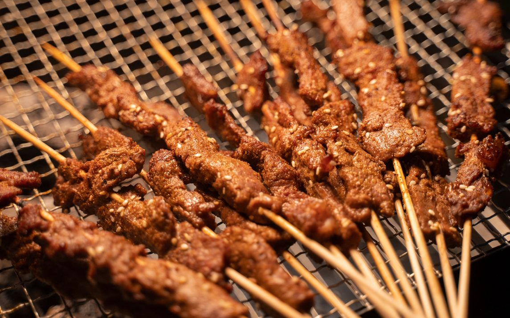

最近老婆和我喜欢在吃饭的时候看《人生一串》，为疫情封控期间的自制料理增添风味。

在看的过程中突然在想，上海人生一串体验店能多大程度复刻当地美食的味道？

每个地方的料理都是就地取材，第三季中有一集说到：“每家的醋都有每家的味道”，如果连醋都有那么大的不同，那么多种类的食材原料、配料、佐料、香料等等，是否都可能和原产地的烧烤料理保持一致？

新疆风味的烤羊串，和东北风味的烤羊肉串会选用两种不同的羊肉来做吗？它们用的辣椒面、孜然、酱油、各类香料都会遵循原产地料理的选材吗？

如果是，那么开这家店的成本也太高了，连醋都要准备好几种，而且都需要从当地运输，几乎不可能。

如果连用料都无法保证 100% 复刻，更不要说师傅的手法、对火候的掌握、用料的比例等等。

所以我觉得人生一串体验店可能也就是一家带有网红 IP 的普通烧烤店而已，并不具备地方特色烧烤料理的代表性。

疫情过去之后，想去吃纪录片里的烧烤，要去当地吃最正宗的，而且必须一次性吃到顶。
