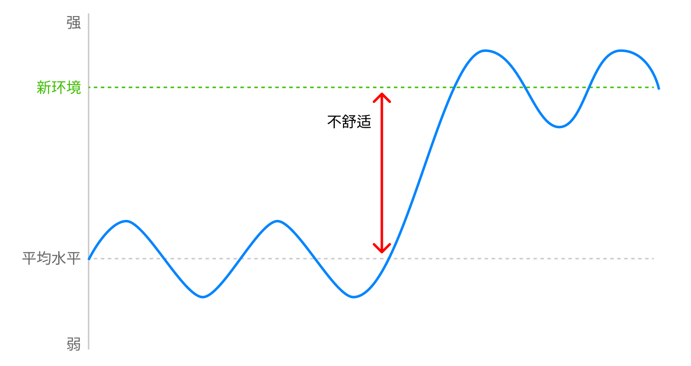

你是否有过这样的经历：下定决心要提升自己某方面能力，可努力了一段时间后感到疲惫无法再坚持下去，水平又退回到原点。这可能是因为你采用了**高功耗成长模式**。

人是一种天生追求舒适和安定的动物，在原始社会中，如果某个地方资源充沛、气候宜人，那么人们就会选择在此定居，该种地种地，该打鱼打鱼，没事尽量不折腾。如果有天突然气候大变，物资匮乏，人们就会为了争夺资源而发动战争，或者迁徙到其他地方，开始无穷无尽的折腾，直到再次回到舒适安定的环境中。所以“待着不动”、“保持现状”、“躺平”并不意味着堕落，而是人的生物性决定的，人天生就该这样。

现代社会的情况更加复杂一点，人类发展出更加丰富的物质环境，人的欲望也越来越多，在原始社会你要可能仅仅是每天能吃饱，而今天你绝对不满足于吃饱，而是吃的有品质，吃的有味道，然后吃饱了就会想要要做点有意思的事情，比如娱乐、社交、旅游等等，再之上可能就是追求社会地位、个人成就、财富等等。

想要在现代社会中取得一定的成功，需要在很多方面付出努力，包括但不限于学习能力、专业技能、管理能力、外在形象、社交能力等等。人们需要更高频的折腾自己，这无疑是反生物性的，大部分人都不具备强大的自律性，我们这副为原始社会打造的肉体似乎并不能很好的适应这样的生活。

那么对于普通人而言，有没有一种比较省力，不那么需要自律性的成长方式呢？

我们某方面的能力水平，通常都在我们身处环境的平均水平附近波动，比如你是一个 30 岁左右的普通上班族，平时不怎么锻炼身体，你的百米冲刺成绩大概会在 15-20 秒左右，你同事们的水平也不会和你相差太多。

但有一天你报名了公司运动会，想要在短期内提高百米冲刺成绩，你开始有意识的锻炼身体，你的腿部肌肉变得更发达了，一星期后你的成绩提高了 1-2 秒。当运动会结束后，你又回到普通的上下班生活，再也没有用到额外锻炼出来的肌肉，这些肌肉增加了你每天的能量消耗，成为了身体的负担，所以一段时间后肌肉开始分解，你的百米冲刺成绩又回到了原点。

当你短期内通过努力提高了某方面能力，如果你身处的环境不需要你拥有这么强的能力，那么它就成为一种负担，占用了你的脑力、体力、精力，这些负担会在一段时间后消失，我把这种成长模式称为**高功耗成长**。

由于人天然具有追求舒适的本能，所以某方面能力也不会长时间低于平均水平太多，比如你刚到一个新的公司，你还不适应新的工作节奏，但过了几个月后也就慢慢适应了。

这种能力提升的方式不需要消耗太多意志力，而且不会随着时间推移而消退，这是我们身体的一个 BUG，我们可以利用这个 BUG 来提升能力，我把这种成长方式称为**低功耗成长**

具体操作方法就是一旦我们开始适应当下环境后，就主动寻求更高水平的环境。不要等到具备下一个层面的能力后再换环境，而是要立刻进入一个更高水平的环境中去。这样我们就可以利用本能的环境适应能力来实现提升。

你会发现游戏的段位设计就是使用了这种**低功耗成长**模式，当你在当前分段连续赢了几把之后就立马晋升到下一个段位了，这中间你的操作和意识都在不断的提高。

同样的，你可以用这种模式来学习任何技能，以我个人经历来说，每次换工作后的前 6 个月里，编程能力进步是最大的，此后的时间能力都和身边的同事不会相差太多，我通过这样的方式学习到大量的编程知识，而没有在业余时间付出额外的努力（当然频繁跳槽是不对的，此处仅为举例）。

高功耗模式和低功耗模式也许在努力程度上没有大多差异，但区别在于前者**越努力越不适**，而后者**越努力越舒适**，前者需要消耗大量的自制力，而后者则不需要。通过不断将自己置于更高水平的环境中，普通人也可以实现持续的自我超越。

